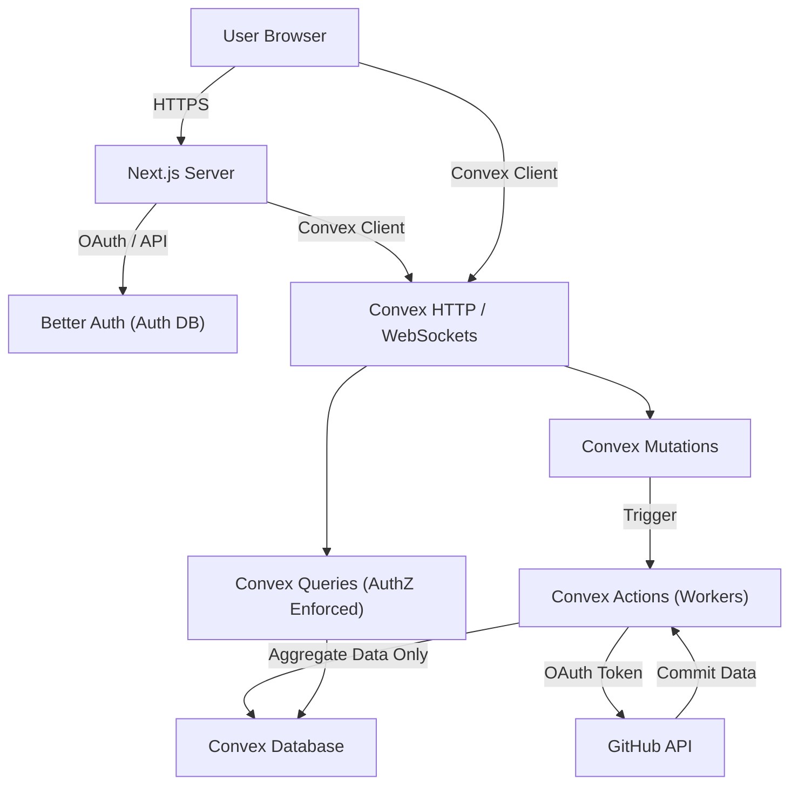

# AI vs Human - Threat Model

## 1. Project Overview & Context
- **Purpose**: A web application that analyzes public and private GitHub repositories to determine the ratio of human-written code vs. AI-assisted code vs. automated bot commits.
- **Tech Stack**: Next.js App Router (React), Tailwind CSS, Convex (Backend-as-a-Service/DB), Better Auth (for GitHub OAuth).
- **Deployment Model**: Vercel for Next.js frontend and serverless API endpoints; Convex for backend state, database, and background sync workers.
- **Exposure**: Publicly accessible web UI.
- **Authentication**: GitHub OAuth required for syncing private data. Public stats can be viewed by anyone.

## 2. Trust Boundaries
- **Client ↔ Next.js Server**: Boundary between the user's browser and the Next.js API endpoints (`app/api/*`). Enforces auth checks and input validation.
- **Next.js Server ↔ Convex DB/Actions**: Boundary between Vercel and Convex. Next.js accesses Convex securely.
- **Convex Actions ↔ GitHub API**: Convex background workers fetch data from GitHub using the user's OAuth token.
- **User ↔ Other Users' Private Data**: Boundary separating a user's private repository stats from public visibility, managed by the `showPrivateDataPublicly` flag.

## 3. Key Assets
- **GitHub OAuth Tokens**: Stored securely to access private repositories. **(High Criticality)**
- **Private Repository Stats**: Aggregated commit counts (human, AI, bot) for private repositories. **(Medium Criticality)**
- **User Profiles**: GitHub usernames, avatars, and follower counts. **(Low Criticality)**
- **Aggregated Public Stats**: Derived from public GitHub data. **(Low Criticality)**

## 4. Threat Scenarios & Abuse Paths

### Threat 1: Unauthorized Access to Private Aggregated Stats (IDOR / Broken AuthZ)
- **Description**: An attacker queries Convex endpoints directly (e.g., `getUserPrivateDailyStats`) to retrieve private commit statistics of another user who has opted out of public visibility.
- **Impact**: Medium. Exposes private activity trends, though not source code.
- **Likelihood**: Medium. Previously High (vulnerability existed), but mitigated by enforcing server-side checks.
- **Priority**: High.
- **Mitigation**: Added `requirePrivateDataAccess` helper to strictly enforce `showPrivateDataPublicly` and ownership on all private stats queries in `convex/queries/privateStats.ts` and `convex/queries/users.ts`.

### Threat 2: GitHub OAuth Token Leakage
- **Description**: Attackers gain access to the Better Auth database or intercept tokens during the sync process.
- **Impact**: Critical. Could allow attackers to read/modify private GitHub repositories.
- **Likelihood**: Low. Tokens are managed by Better Auth, and `privateRepoSync` only processes data in-memory without persisting raw commit details or SHAs.
- **Priority**: Critical.
- **Mitigation**: Rely on Better Auth for secure token storage. Ensure Convex database access is strictly scoped. Pass tokens directly to server-side Convex Actions and never expose them to the client.

### Threat 3: Denial of Service (DoS) via Heavy Syncing
- **Description**: A malicious user rapidly triggers the `requestPrivateSync` or `/api/analyze/resync-user` endpoints, exhausting GitHub API limits or Convex background worker limits.
- **Impact**: Medium. Application downtime or GitHub rate limiting.
- **Likelihood**: Medium.
- **Priority**: Medium.
- **Mitigation**: The system implements `repoResyncRateLimits` in the schema. Ensure rate limiting is strictly enforced on `requestPrivateSync` and `resync-user` API routes.

### Threat 4: Data Poisoning / Forged Commits
- **Description**: An attacker pushes thousands of spoofed commits to a public repo to manipulate the "AI vs Human" leaderboard.
- **Impact**: Low (Reputational). Skews the global statistics and leaderboard rankings.
- **Likelihood**: High (easy to do).
- **Priority**: Low.
- **Mitigation**: The system categorizes commits based on known bot emails and tools. Consider adding anomaly detection for unusually high commit volumes over short periods.

## 5. Architectural Diagram

## 6. Recommendations & Focus Paths
- **Continuous AuthZ Audits**: Ensure every new Convex query or mutation that handles user data explicitly checks the `ctx.auth` object and verifies ownership.
- **Token Scope Minimization**: Ensure the GitHub OAuth request only asks for read-only access to repositories.
- **Rate Limiting**: Actively monitor the `repoResyncRateLimits` implementation to ensure attackers cannot bypass it by creating multiple accounts.